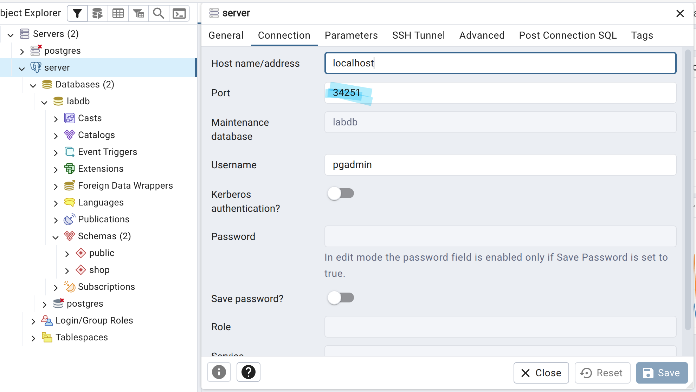
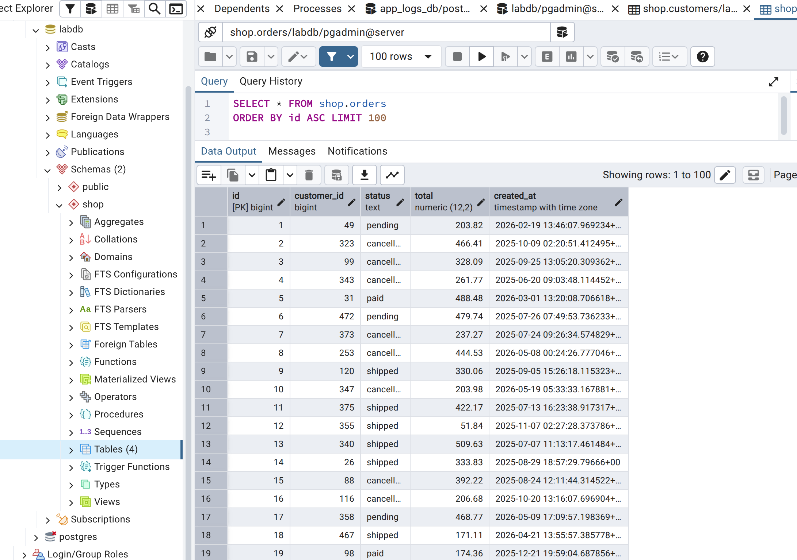

# 🐘 Laboratorio PostgreSQL para Administradores

Entorno completo de prácticas para el curso de administración de PostgreSQL.  
Incluye dos modos de despliegue: **Docker Compose** (local, rápido) y **Kubernetes con Minikube** (más realista).

---

## 📋 Tabla de Contenidos

1. [Arquitectura](#1-arquitectura)
2. [Requisitos del sistema](#2-requisitos-del-sistema)
3. [Instalación de prerrequisitos (Debian/Ubuntu)](#3-instalación-de-prerrequisitos-debianubuntu)
4. [Modo Docker Compose](#4-modo-docker-compose)
5. [Modo Kubernetes con Minikube](#5-modo-kubernetes-con-minikube)
6. [Acceso a los servicios](#6-acceso-a-los-servicios)
7. [Dashboards en Grafana](#7-dashboards-en-grafana)
8. [Datos de laboratorio](#8-datos-de-laboratorio)
9. [Comandos útiles](#9-comandos-útiles)
10. [Estructura del repositorio](#10-estructura-del-repositorio)
11. [Solución de problemas](#11-solución-de-problemas)

---

## 1. Arquitectura

```
┌─────────────────────────────────────────────────────────────┐
│                     LABORATORIO POSTGRESQL                  │
│                                                             │
│  ┌──────────────┐    ┌─────────────────┐    ┌───────────┐  │
│  │  PostgreSQL  │◄───│postgres_exporter│───►│Prometheus │  │
│  │     v17      │    │  puerto 9187    │    │ puerto    │  │
│  │  puerto 5432 │    └─────────────────┘    │  9090     │  │
│  └──────────────┘                           └─────┬─────┘  │
│                                                   │        │
│  ┌──────────────┐    ┌─────────────────┐          ▼        │
│  │   pgAdmin 4  │    │  node_exporter  │    ┌───────────┐  │
│  │  puerto 5050 │    │  puerto 9100    │───►│  Grafana  │  │
│  └──────────────┘    └─────────────────┘    │ puerto    │  │
│                                             │  3000     │  │
│                                             └───────────┘  │
└─────────────────────────────────────────────────────────────┘
```

| Componente | Imagen | Puerto | Descripción |
|---|---|---|---|
| PostgreSQL 17 | `postgres:17` | 5432 | Motor de base de datos |
| postgres_exporter | `prometheuscommunity/postgres-exporter` | 9187 | Métricas PG → Prometheus |
| node_exporter | `prom/node-exporter` | 9100 | Métricas del sistema operativo |
| Prometheus | `prom/prometheus` | 9090 | Motor de métricas y alertas |
| Grafana | `grafana/grafana` | 3000 | Visualización de dashboards |
| pgAdmin 4 | `dpage/pgadmin4` | 5050 | Administración web de PG |

---

## 2. Requisitos del sistema

### Docker Compose
| Recurso | Mínimo | Recomendado |
|---|---|---|
| CPU | 2 cores | 4 cores |
| RAM | 4 GB | 8 GB |
| Disco | 10 GB libres | 20 GB libres |

### Kubernetes (Minikube)
| Recurso | Mínimo | Recomendado |
|---|---|---|
| CPU | 4 cores | 6 cores |
| RAM | 6 GB | 8 GB |
| Disco | 20 GB libres | 40 GB libres |

### Software base
- Linux (Debian 12 / Ubuntu 22.04 / Ubuntu 24.04 o derivados)
- Docker Engine 24+
- Docker Compose plugin v2+
- kubectl 1.28+
- Minikube 1.32+

---

## 3. Instalación de prerrequisitos (Debian/Ubuntu)

El script instala automáticamente Docker, kubectl, Minikube y el cliente `psql`:

```bash
# Dar permisos de ejecución a todos los scripts
chmod +x install-prerequisites.sh start-lab.sh deploy-k8s.sh

# Instalar dependencias (requiere sudo)
sudo ./install-prerequisites.sh
```

> ⚠️ **Importante:** Tras la instalación, cierra y vuelve a abrir tu sesión para que el grupo `docker` se aplique correctamente, o ejecuta `newgrp docker`.

### Verificar la instalación

```bash
docker --version
docker compose version
kubectl version --client
minikube version
psql --version
```

---

## 4. Modo Docker Compose

### 4.1 Inicio rápido

```bash
# Opción A — Script automático
./start-lab.sh
[INFO] Levantando servicios con Docker Compose...
[+] Running 6/6
 ✔ Container node_exporter      Running                                    0.0s 
 ✔ Container postgres           Healthy                                   10.7s 
 ✔ Container pgadmin            Started                                    0.2s 
 ✔ Container postgres_exporter  Started                                    0.3s 
 ✔ Container prometheus         Started                                    0.3s 
 ✔ Container grafana            Started                                    0.3s 
[INFO] Esperando a que PostgreSQL responda...
[INFO] PostgreSQL listo ✅

NAME                IMAGE                                          COMMAND                  SERVICE             CREATED         STATUS                    PORTS
grafana             grafana/grafana:latest                         "/run.sh"                grafana             2 minutes ago   Up Less than a second     0.0.0.0:3000->3000/tcp, [::]:3000->3000/tcp
node_exporter       prom/node-exporter:latest                      "/bin/node_exporter …"   node_exporter       3 minutes ago   Up 2 minutes              
pgadmin             dpage/pgadmin4:latest                          "/entrypoint.sh"         pgadmin             3 minutes ago   Up 1 second               0.0.0.0:5050->80/tcp, [::]:5050->80/tcp
postgres            postgres:17                                    "docker-entrypoint.s…"   postgres            3 minutes ago   Up 11 seconds (healthy)   0.0.0.0:5432->5432/tcp, [::]:5432->5432/tcp
postgres_exporter   prometheuscommunity/postgres-exporter:latest   "/bin/postgres_expor…"   postgres_exporter   3 minutes ago   Up 1 second               0.0.0.0:9187->9187/tcp, [::]:9187->9187/tcp
prometheus          prom/prometheus:latest                         "/bin/prometheus --c…"   prometheus          3 minutes ago   Up Less than a second     0.0.0.0:9090->9090/tcp, [::]:9090->9090/tcp

══════════════════════════════════════════════════════════
 🐘  PostgreSQL   →  localhost:5432  (pgadmin / pgadmin123)
 📊  Grafana      →  http://localhost:3000  (admin / admin123)
 🔥  Prometheus   →  http://localhost:9090
 🖥️   pgAdmin      →  http://localhost:5050  (admin@lab.local / pgadmin123)
 📈  pg_exporter  →  http://localhost:9187/metrics
 📈  node_export  →  http://localhost:9100/metrics
══════════════════════════════════════════════════════════

[INFO] Para detener:             cd docker && docker compose down
[INFO] Para detener + borrar datos: cd docker && docker compose down -v
[INFO] Para ver logs:            cd docker && docker compose logs -f [servicio]


# Opción B — Manual
cd docker
cp .env.example .env        # edita contraseñas si lo deseas
docker compose up -d
```

### 4.2 Verificar que todo está en marcha

```bash
docker compose ps
docker compose logs postgres --tail=20
```

### 4.3 Comprobar que PostgreSQL responde

```bash
psql -h localhost -p 5432 -U pgadmin -d labdb -c "SELECT version();"
# Password: pgadmin123

$ docker exec -it postgres psql -U pgadmin -d labdb
# Password: pgadmin123
```

### 4.4 Detener el entorno

```bash
cd docker
docker compose down          # detiene pero conserva los datos
docker compose down -v       # detiene Y borra los volúmenes (reset completo)
```

### 4.5 Comandos PostgreSQL

```bash
\l                    -- listar todas las bases de datos
\dn                   -- listar esquemas
\dt shop.*            -- listar tablas del esquema shop
\d shop.customers     -- describir estructura de la tabla customers
\di shop.*            -- listar índices del esquema shop
\du                   -- listar usuarios y roles
\x                    -- activar salida expandida (más legible para filas anchas)
\timing               -- mostrar tiempo de ejecución de cada query
\e                    -- abrir editor para escribir queries largas
\q                    -- salir

```

### Bases de datos y esquemas
```bash
sql-- Bases de datos existentes
SELECT datname, pg_size_pretty(pg_database_size(datname)) AS size,
       datcollate, datctype
FROM pg_database
WHERE datistemplate = false;

-- Esquemas del servidor
SELECT schema_name, schema_owner
FROM information_schema.schemata
ORDER BY schema_name;

-- Extensiones instaladas
SELECT extname, extversion FROM pg_extension ORDER BY extname;
```

### Tablas y estructura
```bash
-- Tablas del esquema shop con tamaño
SELECT tablename,
       pg_size_pretty(pg_total_relation_size('shop.'||tablename)) AS total,
       pg_size_pretty(pg_relation_size('shop.'||tablename))       AS datos,
       pg_size_pretty(pg_indexes_size('shop.'||tablename))        AS indices
FROM pg_tables
WHERE schemaname = 'shop'
ORDER BY pg_total_relation_size('shop.'||tablename) DESC;

-- Columnas de una tabla
SELECT column_name, data_type, is_nullable, column_default
FROM information_schema.columns
WHERE table_schema = 'shop' AND table_name = 'customers'
ORDER BY ordinal_position;

-- Índices del esquema shop
SELECT indexname, tablename, indexdef
FROM pg_indexes
WHERE schemaname = 'shop';

-- Claves foráneas
SELECT tc.table_name, kcu.column_name,
       ccu.table_name  AS foreign_table,
       ccu.column_name AS foreign_column
FROM information_schema.table_constraints AS tc
JOIN information_schema.key_column_usage AS kcu
  ON tc.constraint_name = kcu.constraint_name
JOIN information_schema.constraint_column_usage AS ccu
  ON ccu.constraint_name = tc.constraint_name
WHERE tc.constraint_type = 'FOREIGN KEY'
  AND tc.table_schema = 'shop';
```

### Consultas sobre los datos de ejemplo
```bash
-- Contar registros en cada tabla
SELECT 'customers'   AS tabla, count(*) FROM shop.customers
UNION ALL
SELECT 'products',             count(*) FROM shop.products
UNION ALL
SELECT 'orders',               count(*) FROM shop.orders
UNION ALL
SELECT 'order_items',          count(*) FROM shop.order_items;

-- Primeros 5 clientes
SELECT * FROM shop.customers ORDER BY id LIMIT 5;

-- Productos más caros
SELECT sku, name, price, stock
FROM shop.products
ORDER BY price DESC
LIMIT 10;

-- Pedidos por estado
SELECT status, count(*) AS total,
       pg_size_pretty(sum(total)::bigint) AS facturado
FROM shop.orders
GROUP BY status
ORDER BY total DESC;

-- Top 5 clientes por gasto total
SELECT c.name, c.email,
       count(o.id)          AS num_pedidos,
       sum(o.total)::numeric(10,2) AS gasto_total
FROM shop.customers c
JOIN shop.orders o ON o.customer_id = c.id
WHERE o.status = 'paid'
GROUP BY c.id, c.name, c.email
ORDER BY gasto_total DESC
LIMIT 5;

-- Productos más vendidos (por unidades)
SELECT p.sku, p.name,
       sum(oi.qty)                  AS unidades_vendidas,
       sum(oi.qty * oi.unit_price)::numeric(10,2) AS ingresos
FROM shop.order_items oi
JOIN shop.products p ON p.id = oi.product_id
GROUP BY p.id, p.sku, p.name
ORDER BY unidades_vendidas DESC
LIMIT 10;

-- Pedidos del último mes con sus líneas
SELECT o.id, c.name AS cliente, o.status, o.total, o.created_at,
       count(oi.id) AS num_lineas
FROM shop.orders o
JOIN shop.customers   c  ON c.id  = o.customer_id
JOIN shop.order_items oi ON oi.order_id = o.id
WHERE o.created_at >= now() - interval '30 days'
GROUP BY o.id, c.name, o.status, o.total, o.created_at
ORDER BY o.created_at DESC;
```
### Monitorización y rendimiento (lo que verás en Grafana)
```bash
-- Conexiones activas agrupadas por estado
SELECT state, count(*) AS conexiones
FROM pg_stat_activity
GROUP BY state
ORDER BY conexiones DESC;

-- Queries en ejecución ahora mismo
SELECT pid, usename, state,
       round(extract(epoch from clock_timestamp()-query_start)::numeric,2) AS segundos,
       query
FROM pg_stat_activity
WHERE state != 'idle'
  AND query NOT ILIKE '%pg_stat_activity%'
ORDER BY segundos DESC;

-- Estadísticas de uso de tablas (seq scan vs index scan)
SELECT relname,
       seq_scan, idx_scan,
       round(idx_scan::numeric/(idx_scan+seq_scan+1)*100,1) AS pct_idx,
       n_live_tup, n_dead_tup
FROM pg_stat_user_tables
WHERE schemaname = 'shop'
ORDER BY seq_scan DESC;

-- Tamaño de caché (hit ratio: idealmente > 99%)
SELECT sum(heap_blks_hit) AS hits,
       sum(heap_blks_read) AS reads,
       round(sum(heap_blks_hit)::numeric /
             (sum(heap_blks_hit)+sum(heap_blks_read)+1)*100, 2) AS hit_ratio_pct
FROM pg_statio_user_tables;

-- Queries más lentas (requiere pg_stat_statements)
SELECT left(query,80) AS query,
       calls,
       round(mean_exec_time::numeric,2) AS media_ms,
       round(total_exec_time::numeric,2) AS total_ms
FROM pg_stat_statements
ORDER BY mean_exec_time DESC
LIMIT 10;

-- Parámetros clave del servidor
SELECT name, setting, unit, short_desc
FROM pg_settings
WHERE name IN (
  'max_connections','shared_buffers','effective_cache_size',
  'work_mem','maintenance_work_mem','checkpoint_completion_target',
  'wal_buffers','default_statistics_target','log_min_duration_statement'
);
```

### Forzar situaciones de práctica

```bash
-- Generar carga de lecturas (para ver métricas subir en Grafana)
SELECT count(*) FROM shop.order_items oi
JOIN shop.orders   o ON o.id = oi.order_id
JOIN shop.products p ON p.id = oi.product_id
JOIN shop.customers c ON c.id = o.customer_id
WHERE o.status = 'paid' AND p.price > 50;

-- Simular una query lenta (sleep de 5 segundos)
SELECT pg_sleep(5), 'query lenta de prueba' AS msg;

-- Ver el efecto en pg_stat_activity desde otra sesión psql
SELECT pid, state, wait_event_type, wait_event, query
FROM pg_stat_activity
WHERE query LIKE '%pg_sleep%';

-- VACUUM manual y ver resultado
VACUUM ANALYZE shop.orders;
SELECT last_vacuum, last_autovacuum, last_analyze, n_dead_tup
FROM pg_stat_user_tables WHERE relname = 'orders';

```

---

## 5. Modo Kubernetes con Minikube

### 5.1 Inicio rápido

```bash
./deploy-k8s.sh
```

El script realiza automáticamente:
1. Arranca Minikube con 4 CPUs y 4 GB de RAM
2. Habilita los addons `metrics-server`, `ingress` y `storage-provisioner`
3. Aplica todos los manifiestos en orden
4. Espera a que los despliegues estén `Ready`
5. Muestra las URLs de acceso

### 5.2 Arrancar Minikube manualmente

```bash
minikube start \
  --driver=docker \
  --cpus=4 \
  --memory=4096 \
  --disk-size=20g \
  --kubernetes-version=stable

# Habilitar addons
minikube addons enable metrics-server
minikube addons enable ingress
```

### 5.3 Aplicar manifiestos paso a paso

```bash
kubectl apply -f k8s/00-namespace.yaml
kubectl apply -f k8s/01-secrets.yaml
kubectl apply -f k8s/postgres/
kubectl apply -f k8s/exporters/
kubectl apply -f k8s/prometheus/
kubectl apply -f k8s/grafana/
```

### 5.4 Verificar el estado

```bash
kubectl get all -n postgres-lab
kubectl get pods -n postgres-lab -w    # watch en tiempo real
```

### 5.5 Abrir servicios en el navegador

```bash
# Opción A — NodePort directo
MINIKUBE_IP=$(minikube ip)
echo "Grafana:    http://$MINIKUBE_IP:30300"
echo "Prometheus: http://$MINIKUBE_IP:30090"
echo "PostgreSQL: $MINIKUBE_IP:30432"

# Opción B — minikube service (abre el navegador automáticamente)

$ minikube tunnel
✅  Tunnel successfully started

📌  NOTE: Please do not close this terminal as this process must stay alive for the tunnel to be accessible ...

Al ejecutar minikube tunnel, Minikube crea una ruta de red directa utilizando la contraseña de administrador de tu sistema operativo para conectar el rango de IPs de tu red local con la red virtual del clúster. Esto asigna inmediatamente una IP real accesible desde tu máquina.
Importante No cierres esa terminal Tal como advierte el cartel físico en tu consola, debes mantener esa ventana abierta. Si cierras la terminal o cancelas el proceso con Ctrl + C, el túnel se romperá y perderás la conectividad con tus servicios desde el navegador.

$ minikube service grafana -n postgres-lab &

┌──────────────┬─────────┬─────────────┬───────────────────────────┐
│  NAMESPACE   │  NAME   │ TARGET PORT │            URL            │
├──────────────┼─────────┼─────────────┼───────────────────────────┤
│ postgres-lab │ grafana │ web/3000    │ http://192.168.49.2:30300 │
└──────────────┴─────────┴─────────────┴───────────────────────────┘
🔗  Starting tunnel for service grafana.
┌──────────────┬─────────┬─────────────┬────────────────────────┐
│  NAMESPACE   │  NAME   │ TARGET PORT │          URL           │
├──────────────┼─────────┼─────────────┼────────────────────────┤
│ postgres-lab │ grafana │             │ http://127.0.0.1:37751 │
└──────────────┴─────────┴─────────────┴────────────────────────┘
🎉  Opening service postgres-lab/grafana in default browser...
❗  Porque estás usando controlador Docker en linux, la terminal debe abrirse para ejecutarlo.
Se está abriendo en una sesión de navegador existente.


$ minikube service prometheus -n postgres-lab &

│  NAMESPACE   │    NAME    │ TARGET PORT │            URL            │
├──────────────┼────────────┼─────────────┼───────────────────────────┤
│ postgres-lab │ prometheus │ web/9090    │ http://192.168.49.2:30090 │
└──────────────┴────────────┴─────────────┴───────────────────────────┘
🔗  Starting tunnel for service prometheus.
┌──────────────┬────────────┬─────────────┬────────────────────────┐
│  NAMESPACE   │    NAME    │ TARGET PORT │          URL           │
├──────────────┼────────────┼─────────────┼────────────────────────┤
│ postgres-lab │ prometheus │             │ http://127.0.0.1:38033 │
└──────────────┴────────────┴─────────────┴────────────────────────┘
🎉  Opening service postgres-lab/prometheus in default browser...
❗  Porque estás usando controlador Docker en linux, la terminal debe abrirse para ejecutarlo.
Se está abriendo en una sesión de navegador existente.

$ minikube service postgres-nodeport -n postgres-lab &

│  NAMESPACE   │       NAME        │ TARGET PORT │            URL            │
├──────────────┼───────────────────┼─────────────┼───────────────────────────┤
│ postgres-lab │ postgres-nodeport │ 5432        │ http://192.168.49.2:30432 │
└──────────────┴───────────────────┴─────────────┴───────────────────────────┘
🔗  Starting tunnel for service postgres-nodeport.
┌──────────────┬───────────────────┬─────────────┬────────────────────────┐
│  NAMESPACE   │       NAME        │ TARGET PORT │          URL           │
├──────────────┼───────────────────┼─────────────┼────────────────────────┤
│ postgres-lab │ postgres-nodeport │             │ http://127.0.0.1:34251 │
└──────────────┴───────────────────┴─────────────┴────────────────────────┘
🎉  Opening service postgres-lab/postgres-nodeport in default browser...
❗  Porque estás usando controlador Docker en linux, la terminal debe abrirse para ejecutarlo.
Se está abriendo en una sesión de navegador existente.


# Opción C — port-forward
kubectl port-forward svc/grafana    3000:3000 -n postgres-lab &
kubectl port-forward svc/prometheus 9090:9090 -n postgres-lab &
kubectl port-forward svc/postgres   5432:5432 -n postgres-lab &

Acceso a Grafana http://localhost:3000/login

Credenciales de acceso a grafana
Usuario:admin
Password:admin123

Acceso a prometheus http://localhost:9090/query

Métricas de prometheus http://localhost:9090/metrics
Respuesta del endpoint /metrics:
# HELP go_gc_cleanups_executed_cleanups_total Approximate total count of cleanup functions (created by runtime.AddCleanup) executed by the runtime. Subtract /gc/cleanups/queued:cleanups to approximate cleanup queue length. Useful for detecting slow cleanups holding up the queue. Sourced from /gc/cleanups/executed:cleanups.
# TYPE go_gc_cleanups_executed_cleanups_total counter
go_gc_cleanups_executed_cleanups_total 0
# HELP go_gc_cleanups_queued_cleanups_total Approximate total count of cleanup functions (created by runtime.AddCleanup) queued by the runtime for execution. Subtract from /gc/cleanups/executed:cleanups to approximate cleanup queue length. Useful for detecting slow cleanups holding up the queue. Sourced from /gc/cleanups/queued:cleanups.
# TYPE go_gc_cleanups_queued_cleanups_total counter

```

### 5.6 Aplicación pgadmin

La aplicación pgadmin se puede descargar e instalar en nuestra máquina desde https://www.pgadmin.org
Crear una conexión con los siguientes datos de la imagen,teniendo en cuenta que en el caso de levantar los servicios utilizando la opción B, el puerto hay que poner el que nos ha devuelto el servicio de postgres-nodeport cuando hemos ejecutado el comando minikube service postgres-nodeport -n postgres-lab &

Si optamos por la opción C(port forward),el puerto es el 5432

Para esta conexión,la password es pgadmin123



Se han definido 2 schemas,public y shop.
El esquema shop tiene 4 tablas para realizar consultas




### 5.7 Destruir el entorno K8s

```bash
# Borrar solo los recursos del lab
kubectl delete namespace postgres-lab

# Detener Minikube
minikube stop

# Borrar la VM de Minikube por completo
minikube delete
```

---

## 6. Acceso a los servicios

### Docker Compose

| Servicio | URL / Conexión | Usuario | Contraseña |
|---|---|---|---|
| PostgreSQL | `localhost:5432` | `pgadmin` | `pgadmin123` |
| Grafana | http://localhost:3000 | `admin` | `admin123` |
| Prometheus | http://localhost:9090 | — | — |
| pgAdmin | http://localhost:5050 | `admin@lab.local` | `pgadmin123` |
| pg_exporter metrics | http://localhost:9187/metrics | — | — |

### Kubernetes (Minikube)

Sustituye `<MINIKUBE_IP>` por la salida de `minikube ip`.

| Servicio | URL / Conexión | Usuario | Contraseña |
|---|---|---|---|
| PostgreSQL | `<MINIKUBE_IP>:30432` | `pgadmin` | `pgadmin123` |
| Grafana | `http://<MINIKUBE_IP>:30300` | `admin` | `admin123` |
| Prometheus | `http://<MINIKUBE_IP>:30090` | — | — |

---

## 7. Dashboards en Grafana

### Importar dashboards de la comunidad

Grafana dispone de dashboards mantenidos por la comunidad.  
En la UI: **Dashboards → Import → ID del dashboard**.

| Dashboard | ID | Descripción |
|---|---|---|
| PostgreSQL Overview | **9628** | Métricas principales de PG (oficial de Prometheus) |
| PostgreSQL Database | **455** | Estadísticas por base de datos |
| Node Exporter Full | **1860** | Métricas completas del sistema operativo |
| PostgreSQL Bloat | **14731** | Monitorización de bloat y VACUUM |

**Pasos:**
1. Abrir Grafana → **Dashboards** → **New** → **Import**
2. Introducir el ID y pulsar **Load**
3. Seleccionar el datasource `Prometheus` y pulsar **Import**

---

## 8. Datos de laboratorio

Al iniciar el contenedor de PostgreSQL por primera vez, el script `init-scripts/01_init.sql` crea automáticamente:

### Extensiones habilitadas
- `pg_stat_statements` — análisis de consultas
- `pg_trgm` — búsqueda de texto aproximado
- `pgcrypto` — funciones criptográficas
- `uuid-ossp` — generación de UUIDs

### Esquema `shop`
- `shop.customers` — 500 clientes de ejemplo
- `shop.products` — 200 productos con SKU
- `shop.orders` — 2 000 pedidos aleatorios
- `shop.order_items` — líneas de pedido

### Usuarios creados
| Usuario | Contraseña | Rol |
|---|---|---|
| `pgadmin` | `pgadmin123` | Superusuario del lab |
| `monitor` | `monitor123` | Solo lectura (`pg_monitor`) |
| `appuser` | `app123` | Usuario de aplicación |

### Consultas de práctica

```sql
-- Ver las queries más lentas
SELECT query, calls, total_exec_time, mean_exec_time
FROM pg_stat_statements
ORDER BY mean_exec_time DESC
LIMIT 10;

-- Ver conexiones activas
SELECT pid, usename, application_name, state, query_start, query
FROM pg_stat_activity
WHERE state != 'idle';

-- Tamaño de las tablas
SELECT schemaname, tablename,
       pg_size_pretty(pg_total_relation_size(schemaname||'.'||tablename)) AS total_size
FROM pg_tables
WHERE schemaname = 'shop'
ORDER BY pg_total_relation_size(schemaname||'.'||tablename) DESC;

-- Ratio de uso de índices
SELECT relname, idx_scan, seq_scan,
       round(idx_scan::numeric/(idx_scan+seq_scan+1)*100, 2) AS idx_ratio_pct
FROM pg_stat_user_tables
ORDER BY seq_scan DESC;
```

---

## 9. Comandos útiles

### PostgreSQL

```bash
# Conectar con psql (Docker)
psql -h localhost -p 5432 -U pgadmin -d labdb

# Conectar con psql (Kubernetes)
psql -h $(minikube ip) -p 30432 -U pgadmin -d labdb

# Ver logs de PostgreSQL (Docker)
docker compose logs postgres -f

# Ver logs (K8s)
kubectl logs statefulset/postgres -n postgres-lab -f

# Entrar al contenedor
docker compose exec postgres psql -U pgadmin -d labdb
kubectl exec -it statefulset/postgres -n postgres-lab -- psql -U pgadmin -d labdb
```

### Prometheus

```bash
# Recargar configuración sin reiniciar (Docker)
curl -X POST http://localhost:9090/-/reload

# Ver targets activos
curl -s http://localhost:9090/api/v1/targets | jq '.data.activeTargets[].labels'

# Consulta PromQL de ejemplo
curl -s 'http://localhost:9090/api/v1/query?query=pg_up' | jq '.data.result'
```

### Kubernetes

```bash
# Estado general del namespace
kubectl get all -n postgres-lab

NAME                                    READY   STATUS    RESTARTS   AGE
pod/grafana-58f8f4cc4c-dsgjr            1/1     Running   0          96m
pod/node-exporter-56c69b8c4f-7tnsg      1/1     Running   0          96m
pod/pgadmin-65fbdf6dd4-7m7qd            1/1     Running   0          80m
pod/postgres-0                          1/1     Running   0          96m
pod/postgres-exporter-7fb5dd5dd-nfppb   1/1     Running   0          96m
pod/prometheus-5bd44c8c7f-mvddc         1/1     Running   0          96m

NAME                        TYPE        CLUSTER-IP       EXTERNAL-IP   PORT(S)          AGE
service/grafana             NodePort    10.103.2.185     <none>        3000:30300/TCP   96m
service/node-exporter       ClusterIP   10.111.249.238   <none>        9100/TCP         96m
service/pgadmin             NodePort    10.104.61.115    <none>        80:30050/TCP     80m
service/postgres            ClusterIP   10.99.155.14     <none>        5432/TCP         96m
service/postgres-exporter   ClusterIP   10.111.50.21     <none>        9187/TCP         96m
service/postgres-headless   ClusterIP   None             <none>        5432/TCP         96m
service/postgres-nodeport   NodePort    10.109.97.81     <none>        5432:30432/TCP   96m
service/prometheus          NodePort    10.97.158.161    <none>        9090:30090/TCP   96m

NAME                                READY   UP-TO-DATE   AVAILABLE   AGE
deployment.apps/grafana             1/1     1            1           96m
deployment.apps/node-exporter       1/1     1            1           96m
deployment.apps/pgadmin             1/1     1            1           80m
deployment.apps/postgres-exporter   1/1     1            1           96m
deployment.apps/prometheus          1/1     1            1           96m

NAME                                          DESIRED   CURRENT   READY   AGE
replicaset.apps/grafana-58f8f4cc4c            1         1         1       96m
replicaset.apps/node-exporter-56c69b8c4f      1         1         1       96m
replicaset.apps/pgadmin-65fbdf6dd4            1         1         1       80m
replicaset.apps/postgres-exporter-7fb5dd5dd   1         1         1       96m
replicaset.apps/prometheus-5bd44c8c7f         1         1         1       96m

NAME                        READY   AGE
statefulset.apps/postgres   1/1     96m


# Eventos (útil para debugar)
kubectl get events -n postgres-lab --sort-by='.lastTimestamp'

# Describir un pod con problemas
kubectl describe pod <nombre-pod> -n postgres-lab

# Ver logs de Grafana
kubectl logs deployment/grafana -n postgres-lab --tail=50

# Escalar replicas (ejemplo)
kubectl scale deployment prometheus --replicas=1 -n postgres-lab

# Ejecutar una query directa contra PG desde dentro del cluster
kubectl exec -it statefulset/postgres -n postgres-lab -- \
  psql -U pgadmin -d labdb -c "SELECT count(*) FROM shop.orders;"
```

---

## 10. Estructura del repositorio

```
postgres-lab/
├── install-prerequisites.sh    # Instala Docker, kubectl, Minikube
├── start-lab.sh                # Levanta el entorno Docker Compose
├── deploy-k8s.sh               # Despliega en Minikube
│
├── docker/
│   ├── docker-compose.yml      # Definición de servicios
│   ├── .env.example            # Variables de entorno (copiar a .env)
│   └── init-scripts/
│       └── 01_init.sql         # Datos y extensiones del laboratorio
│
├── k8s/
│   ├── 00-namespace.yaml
│   ├── 01-secrets.yaml
│   ├── postgres/
│   │   └── postgres.yaml       # StatefulSet + Services + ConfigMap
│   ├── exporters/
│   │   ├── postgres-exporter.yaml
│   │   └── node-exporter.yaml
│   ├── prometheus/
│   │   └── prometheus.yaml     # Deployment + RBAC + ConfigMap + Service
│   └── grafana/
│       └── grafana.yaml        # Deployment + ConfigMaps + Service
│
└── config/
    ├── prometheus/
    │   ├── prometheus.yml       # Configuración de scraping
    │   └── rules/
    │       └── postgres_alerts.yml  # Reglas de alertas
    ├── postgres-exporter/
    │   └── queries.yaml        # Consultas personalizadas
    ├── grafana/
    │   └── provisioning/
    │       ├── datasources/
    │       │   └── prometheus.yml
    │       └── dashboards/
    │           └── dashboards.yml
    └── pgadmin/
        └── servers.json        # Conexión pre-configurada a PG
```

---

## 11. Solución de problemas

### PostgreSQL no arranca

```bash
# Revisar logs
docker compose logs postgres --tail=50

# Problema frecuente: permisos en el volumen
docker compose down -v   # borra el volumen y reinicia limpio
docker compose up -d
```

### postgres_exporter no conecta

```bash
# Verificar que PG acepta la conexión
docker compose exec postgres_exporter \
  pg_isready -h postgres -U pgadmin -d labdb

# Revisar que pg_stat_statements está activo
docker compose exec postgres \
  psql -U pgadmin -d labdb -c "SELECT * FROM pg_extension WHERE extname='pg_stat_statements';"
```

### Prometheus no recibe métricas

```bash
# Ver targets en la UI: http://localhost:9090/targets
# O con curl:
curl -s http://localhost:9090/api/v1/targets | jq '.data.activeTargets[] | {job: .labels.job, health: .health, lastError: .lastError}'
```

### Minikube sin recursos suficientes

```bash
# Ver uso de recursos
kubectl top nodes
kubectl top pods -n postgres-lab

# Reiniciar Minikube con más recursos
minikube delete
minikube start --driver=docker --cpus=6 --memory=8192
```

### Pod en estado `Pending`

```bash
# Ver por qué no se ha planificado
kubectl describe pod <nombre-pod> -n postgres-lab | grep -A5 Events
# Causa frecuente: PVC sin almacenamiento disponible
kubectl get pvc -n postgres-lab
```

### Resetear el entorno por completo

```bash
# Docker
cd docker && docker compose down -v && cd ..

# Kubernetes
kubectl delete namespace postgres-lab
minikube delete
```

---

## 📚 Referencias

- [PostgreSQL 17 Documentation](https://www.postgresql.org/docs/17/)
- [postgres_exporter](https://github.com/prometheus-community/postgres_exporter)
- [Prometheus Documentation](https://prometheus.io/docs/)
- [Grafana Documentation](https://grafana.com/docs/)
- [Minikube Documentation](https://minikube.sigs.k8s.io/docs/)
- [Grafana Dashboards — PostgreSQL](https://grafana.com/grafana/dashboards/?search=postgresql)

---

> **Curso PostgreSQL para Administradores** · Entorno de laboratorio v1.0  
> Generado con ❤️ para prácticas en distribuciones basadas en Debian
